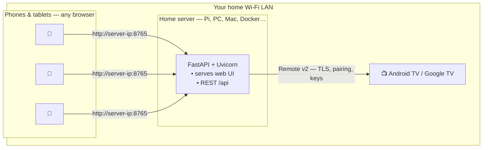
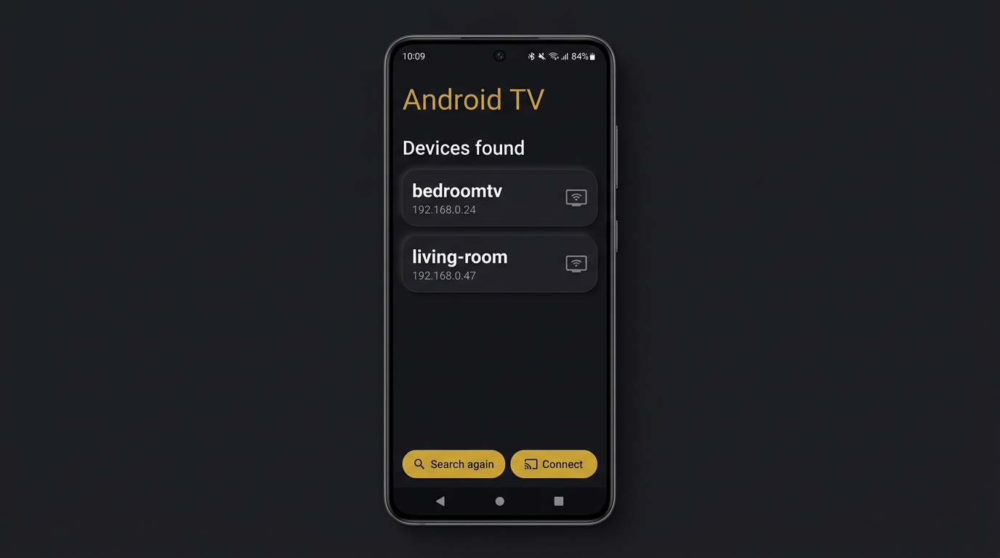
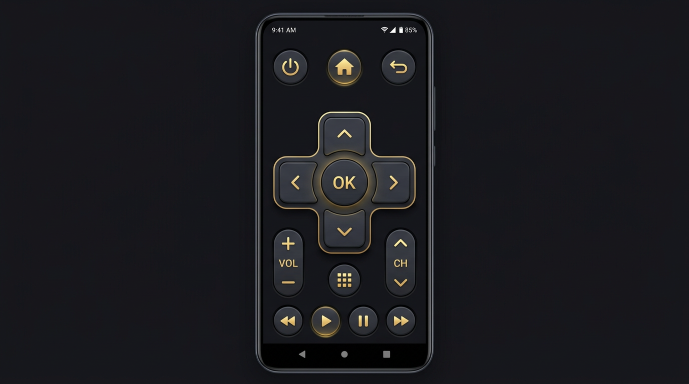

# Self-hosted Android TV Remote

## **TOTALLY FUCKING FREE · NO ADS · NO TRACKING · NO SUBSCRIPTION · NO SIGN‑UP**

*No login walls. No “watch an ad to unlock volume.” No data sold to ad networks. It runs on **your** Wi‑Fi and doesn’t nag you.*

*Estoy harto de aplicaciones de TV remote que no paran de sacarte anuncios — por eso existe esto.*

**Control your Google TV / Android TV from any browser on your Wi‑Fi — no cloud, no vendor account.**

[](https://www.python.org/)
[](https://fastapi.tiangolo.com/)
[](LICENSE)

[Docker Hub (1 command)](#docker-hub-quick-run) · [Features](#features) · [How it works](#how-it-works) · [Screenshots](#screenshots) · [Not a programmer?](#not-a-programmer) · [Quick start](#quick-start) · [Docker](#docker) · [API](#http-api) · [Contributing](#contributing)

</div>

---

Run a tiny **FastAPI** server on your Mac, PC, or Raspberry Pi. Your phone opens a **mobile-first web UI** to discover TVs, pair once, and send keys (power, D‑pad, volume, media). Prefer a **desktop window** or **terminal**? Those are included too.

Uses the official **Android TV Remote v2** protocol via [`androidtvremote2`](https://pypi.org/project/androidtvremote2/) — the same family of APIs the Google TV app uses on the local network.

---

<div align="center">

---

### Docker Hub quick run

Copy–paste (change **`8765`** everywhere if you want another port; keep host and container ports the same):

```bash
docker run -d --name androidtv-remote \
  -p 8765:8765 \
  -e ANDROIDTV_PORT=8765 \
  -v androidtv-config:/root/.config/androidtv-remote \
  pepe12341234/tv-remove-selfhosted:latest
```

On your **phone or tablet** (same Wi‑Fi as the server), open:

**`http://<YOUR-LAN-IP>:8765`**

Replace **`<YOUR-LAN-IP>`** with this machine’s address (e.g. `192.168.1.42`). Replace **`8765`** with your port if you changed it above.

*Image: [`pepe12341234/tv-remove-selfhosted:latest`](https://hub.docker.com/r/pepe12341234/tv-remove-selfhosted)*

---


## How it works

**One** small computer on your network runs the app (a **Raspberry Pi**, an old laptop, a NAS, or your desktop). It **hosts the web page** and the **API**. **Many** phones or tablets can open the same URL at once — each browser loads the UI from that machine; the server is the single place that pairs with the TV and sends remote keys.



Nothing goes through the public internet for control: traffic stays between **clients ↔ your server** and **server ↔ TV** on the LAN.

---

## Screenshots

<p align="center">
  
  &nbsp;&nbsp;
  
</p>

<p align="center">
  <em>Left: discover devices by name (mDNS). Right: full remote in the browser — self-hosted on your LAN.</em>
</p>

> **Note:** Screenshots are illustrative mockups of the UI style. Your real device list and layout match the live app.

---

## Why self-hosted?

| | |
|---|---|
| **Privacy** | Traffic stays on your LAN. No third-party server sees when you change channels. |
| **Reliability** | Works when the internet is down, as long as Wi‑Fi and the TV are up. |
| **Hackable** | REST API, plain Python — script it, theme it, or wrap it in your own stack. |

---

## Features

- **Discovery** — finds TVs advertising `_androidtvremote2._tcp`; shows **friendly instance names** (e.g. `bedroomtv`), not just hostnames
- **Pairing** — one-time 6-character hex code on the TV; client cert stored in `~/.config/androidtv-remote/`
- **Reconnect** — handles dropped sessions (idle timeouts) with automatic reconnect
- **Three interfaces** — **web** (default), **Tk** desktop (`--tk`), **CLI** (`--cli`)
- **LAN-ready** — listens on `0.0.0.0` so phones and tablets can connect via `http://<your-pc-ip>:8765`
- **Web UI** — **Vue 3** + **Vite** + **Tailwind CSS** (`frontend/`), built into `static/dist/` for FastAPI to serve
- **Docker** — multi-stage image: builds the UI with Node, runs **FastAPI + Uvicorn** on Python slim (**no** Tkinter / `main.py` in the container)

---

## Not a programmer?

You **do not** need to know how to program. The easiest way is **Docker**: one free app on your computer, then **one command**.

### What you need

- A **Windows**, **Mac**, or **Linux** PC that stays on while you use the remote  
- The PC and the **TV on the same Wi‑Fi** (same home network)  
- About **10 minutes** the first time  

### Steps (Docker — recommended)

1. **Install Docker Desktop**  
   - Download: [https://www.docker.com/products/docker-desktop/](https://www.docker.com/products/docker-desktop/)  
   - Install it like any normal app and **start Docker** (whale icon in the menu bar / taskbar).

2. **Get this project on your computer**  
   - On GitHub: green **Code** button → **Download ZIP**  
   - Unzip it (e.g. to your **Desktop**). You should see a folder that contains `docker-compose.yml`.

3. **Open a terminal in that folder**  
   - **Mac:** right‑click the folder → **Services** → **New Terminal at Folder** (or open Terminal, type `cd `, drag the folder into the window, press Enter).  
   - **Windows:** open the folder in Explorer, click the address bar, type `powershell`, press Enter.

4. **Start the app**  
   Copy–paste **one** of these (first run can take a few minutes):

   - **Mac or Windows (Docker Desktop):** bridge network — use this file:

     ```bash
     docker compose -f docker-compose.bridge.yml up --build
     ```

   - **Linux:** host network (same LAN as your PC):

     ```bash
     docker compose up --build
     ```

5. **Use your phone as the remote**  
   - Find your **computer’s IP** on Wi‑Fi (phone and PC must be on the same network).  
   - On the phone’s browser, open: **`http://THAT-IP:8765`**  
     Example: `http://192.168.1.42:8765`  
   - Pick your TV from the list (or use **Connect by IP** if the list is empty).  
   - If the TV asks for **pairing**, type the **6 hex characters** shown on the TV screen.

6. **Stop the server** when you’re done  
   In the terminal, press **Ctrl+C**.

### If the TV list is empty

That’s normal in Docker on some networks. Tap **“Connect by IP”**, find your TV’s IP in **Android TV → Settings → Network**, and enter it.

### ¿No eres programador? (español)

No hace falta saber programar. Lo más fácil es usar **Docker**:

1. Instala **Docker Desktop** desde [docker.com](https://www.docker.com/products/docker-desktop/) y ábrelo.  
2. Descarga el proyecto en **ZIP** desde GitHub (**Code** → **Download ZIP**) y descomprímelo (por ejemplo en el escritorio).  
3. Abre una **terminal** dentro de esa carpeta (la que contiene `docker-compose.yml`).  
4. Ejecuta **una** de estas y espera a que termine de construir: en **Mac o Windows**, `docker compose -f docker-compose.bridge.yml up --build` · en **Linux**, `docker compose up --build`.  
5. En el **móvil** (misma Wi‑Fi que el PC), abre el navegador en **`http://IP-DE-TU-PC:8765`**.  
6. Elige la TV o usa **Conectar por IP** si no aparece. Si pide **emparejamiento**, escribe el **código hex de 6 caracteres** que muestra la TV.  
7. Para parar el servidor, en la terminal pulsa **Ctrl+C**.

---

## Quick start

**Requirements:** Python **3.12+**, **Node.js 20+** (for building the web UI), same Wi‑Fi as the TV, [uv](https://github.com/astral-sh/uv) recommended.

```bash
git clone https://github.com/YOUR_USERNAME/androidtv.git
cd androidtv
cd frontend && npm install && npm run build && cd ..
uv sync
uv run python main.py
```

If `static/dist/` is missing, the server returns `503` with build instructions. After changing Vue/Tailwind code, run `npm run build` in `frontend/` again (or use `npm run dev` for local UI development — see below).

The terminal prints a URL like `http://192.168.x.x:8765`. Open it on your **phone** (same network).

| Mode | Command |
|------|---------|
| **Web + API** (default) | `uv run python main.py` |
| **Desktop (Tk)** | `uv run python main.py --tk` |
| **Terminal** | `uv run python main.py --cli` |

Optional: `ANDROIDTV_PORT=9000 uv run python main.py` to change the port.

---

## Docker

The **Dockerfile** is **multi-stage**:

| Stage | Image | What it does |
|-------|--------|----------------|
| **frontend** | `node:20-alpine` | `npm ci`, copies `frontend/`, runs `npm run build` → `static/dist` |
| **runtime** | `python:3.12-slim-bookworm` | Installs **FastAPI**, **Uvicorn**, **androidtvremote2**, **zeroconf** with `pip`; copies only **`web.py`**, **`tv_core.py`**, and the built **`static/dist/`** |

`main.py` is **not** copied into the image: it imports **Tkinter**, which is not used in the container. The process is started with **Uvicorn** directly:

```text
python -m uvicorn web:app --host 0.0.0.0 --port ${ANDROIDTV_PORT:-8765}
```

### Run with Compose (recommended)

```bash
docker compose up --build
```

Then open **http://localhost:8765** (from another device on the LAN: `http://<host-ip>:8765`).

**Linux:** `docker-compose.yml` uses **`network_mode: host`** — the container shares **the same network as your PC** (multicast / mDNS discovery behaves like running Python on the host). It still mounts **`androidtv-config`** → **`/root/.config/androidtv-remote`** for TLS certs and pairing.

**Docker Desktop (Mac / Windows):** host networking is **not supported**. Use the bridge file instead:

```bash
docker compose -f docker-compose.bridge.yml up --build
```

Change the listening port (host network), for example:

```bash
ANDROIDTV_PORT=9000 docker compose up --build
```

### Build / run the image without Compose

```bash
docker build -t androidtv-remote .
docker run --rm -p 8765:8765 -v androidtv-config:/root/.config/androidtv-remote androidtv-remote
```

### Discovery & networking

- **Different network than the TV?** Discovery uses **mDNS** (multicast) on the local LAN. If the TV is on another **subnet**, **VLAN**, **guest Wi‑Fi**, or a **different router**, the list is often **empty** — not because Docker is “on another internet”, but because **multicast does not cross** those boundaries the way you expect. **Connect by IP** can still work if your PC can **route** to the TV’s IP and nothing blocks the remote port (firewall).
- **Linux + default `docker-compose.yml`:** **`network_mode: host`** puts the app on the **same network stack as the PC**, so discovery usually matches a non‑Docker run.
- **Bridge** (`docker-compose.bridge.yml`, or `docker run -p …`): **mDNS** from inside the container often **misses** TVs. Use **Connect by IP** in the web UI.

### Web UI development

```bash
cd frontend
npm install
npm run dev   # Vite on http://127.0.0.1:5173 — proxy API to your FastAPI or run backend separately
```

For a full-stack flow, run `uv run python main.py` in one terminal and `npm run dev` in another; configure Vite `server.proxy` if you want `/api` forwarded to the Python backend (optional). For production, always `npm run build` so `static/dist/` is up to date.

---

## Pairing & data on disk

First connection may show a code on the TV. The app stores:

```
~/.config/androidtv-remote/client.pem
~/.config/androidtv-remote/client.key
```

Treat these like credentials for your remote identity.

**Docker:** the same paths exist **inside the container** under **`/root/.config/androidtv-remote`**; Compose persists them with the **`androidtv-config`** volume.

---

## HTTP API

Handy for Home Assistant, shortcuts, or your own scripts — same process as the web UI.

| Method | Path | Description |
|--------|------|-------------|
| `GET` | `/` | Web UI |
| `GET` | `/api/status` | `{ connected, pairing }` |
| `POST` | `/api/scan` | List `{ name, ip }` for ~5s |
| `POST` | `/api/connect` | Body `{ "ip": "..." }` → `{ state: "connected" \| "pairing" }` |
| `POST` | `/api/pair` | Body `{ "code": "xxxxxx" }` (hex) |
| `POST` | `/api/key` | Body `{ "key": "POWER" }` — see keys below |

**Example keys:** `POWER`, `HOME`, `BACK`, `MENU`, `MUTE`, `VOLUME_UP`, `VOLUME_DOWN`, `DPAD_UP`, `DPAD_DOWN`, `DPAD_LEFT`, `DPAD_RIGHT`, `DPAD_CENTER`, `MEDIA_PLAY_PAUSE`, … (full set follows Android `RemoteKeyCode` in `androidtvremote2`).

---

## Project layout

```
.
├── main.py              # Entry: web (default) | --tk | --cli
├── web.py               # FastAPI + routes; serves static/dist/index.html
├── tv_core.py           # Session, scan, pairing, keys
├── frontend/            # Vue 3 + Vite + Tailwind (npm run build → ../static/dist)
├── Dockerfile           # Multi-stage: Node 20 → build UI; Python 3.12 slim → uvicorn web:app
├── docker-compose.yml   # Linux: host network (same LAN as PC) + volume for pairing certs
├── docker-compose.bridge.yml  # Mac/Windows Docker Desktop: published port + bridge
├── static/dist/         # Vite build output (local `npm run build`, or produced in Docker)
├── assets/screenshots/  # README images
├── pyproject.toml
├── LICENSE              # MIT
└── CONTRIBUTING.md
```

---

## Security

- **No authentication by default** — anyone on your LAN who reaches the port can use the API. Do **not** port-forward this to the public internet without TLS, auth, or VPN.
- Control traffic to the TV uses the **device’s TLS remote protocol**; your browser only talks to **your** FastAPI instance.

---

## Contributing

We welcome issues and pull requests. Please read **[CONTRIBUTING.md](CONTRIBUTING.md)** before submitting a PR.

**Ideas:** UI themes, i18n, optional API token, pre-built images on a registry, systemd unit examples.

---

## Credits

- [androidtvremote2](https://pypi.org/project/androidtvremote2/) — protocol implementation  
- [zeroconf](https://pypi.org/project/zeroconf/) — mDNS discovery  
- [FastAPI](https://fastapi.tiangolo.com/) & [Uvicorn](https://www.uvicorn.org/) — web stack  

---

## License

This project is licensed under the **MIT License** — see [LICENSE](LICENSE).
